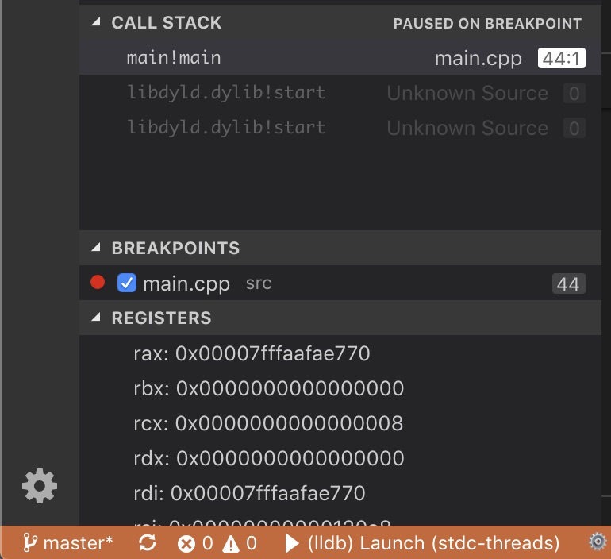

# adv-cppdbg README

This extension is intended to provide features that the default [vscode-cpptools](https://marketplace.visualstudio.com/items?itemName=ms-vscode.cpptools) does not for C/C++ development. Main intent is to provide a view for CPU registers, memory windows and perhaps a disassbmly window. It is intended to co-exist (and supplement) with vscode-cpptools

**This is not yet available on the market place so, you have to download the source code and build+experiment with it. Not an easy task. Will see what I can do about that**

*We may abandon this project if we cannot get support for events to do auto-refresh*

## Features

The following features are intended to work for programs running on a local machine or on a remote machine or a development board with totally different CPU architectures or OSes

### Register View

Display the CPU registers for the program being debugged. Current state is that it kind of works but you have to trigger a manual refresh. As an extension, I have no idea if the debugger is in paused state or running or when to refresh the registers view. VSCode folks have to help provide events for such things and I have requests for the same. Intention is to automatically refresh and be able to view and maybe even modify register values.

To use this feature, you have to be in paused state and using the Command Palette, run the command 'Adv-Cppdbg: Refresh'

### Memory Windows (coming)

One or more windows to show a range of memory. Right now, you can do it in the **Watch** window using an appropriate C expression

### Disassembly Window (maybe)

This is a much more ambitious feature for those focused on performance and compiler efficiency and how their C/C++ code translates into machine code

## Requirements

None. The extention automatically triggers when it detects that a debug session of type 'cppdbg' (lldb/gdb) has started.

## Extension Settings

Nothing yet, but I am sure they are coming. Ideas welcome. For instance you may not want to look at all the registers and specify your subset. Perhaps disable the extension.

## Known Issues

There is no auto refresh. I also think it could be faster if I am able to retrieve information from gdb/lldb in bulk. Currently, I have to query one register at a time because of how the VSCode APIs work.

## Release Notes

No release yet.

### 0.0.1

Barely functional register view. Works with gdb/lldb. Tested on Mac x64 and ARM processors.

-----------------------------------------------------------------------------------------------------------
