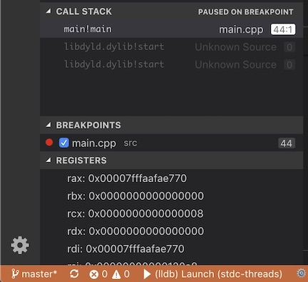

# adv-cppdbg README

This extension is intended to provide features that the default [vscode-cpptools](https://marketplace.visualstudio.com/items?itemName=ms-vscode.cpptools) does not for C/C++ development. Main intent is to provide a view for CPU registers, memory windows and perhaps a disassbmly window. It is intended to supplement the vscode-cpptools extension

This is not yet available on the market place so, you have to download the vsix file and install it manually.

    code --install-extension filename.vsix

We may abandon this project if we cannot implement memory and/or disassembly windows. We may need help from the core VSCode team to get those implemented. We can do everything if we write our own adapter but that is a big task. At least, for now registers view works pretty well and auto-refreshes thanks to a MS engineer guiding me.

## Features

The following features are intended to work for programs running on a local machine or on a remote machine or a development board with totally different CPU architectures or OSes

### Register View

The Registers VIew diplays all the registers reported by gdb/lldb. The are not grouped or filtered. We may add a feature for you to specify what to filter. You cannot yet change register values. I want to see if I can color code for what changed.



### Memory Windows (coming)

One or more windows to show a range of memory. Right now, you can do it in the **Watch** window using an appropriate C expression. We will implement memory windows is only if we can do registers properly and efficiently.

### Disassembly Window (maybe)

This is a much more ambitious feature for those focused on performance and compiler efficiency and how their C/C++ code translates into machine code. We will also need to do stepi/nexti (assembly level step and next) whch the VSCode API/protocol does not support yet.

## Requirements

None. The extention automatically triggers when it detects that a debug session of type 'cppdbg' (lldb/gdb) has started. Will add cppvsdbg shortly.

## Extension Settings

There are two settings currently available (in your .vscode/settings.json)

```"adv-cppdbg.debugLevel": integer```

Must be >= 0. Default=1 You can use this to get information about what the extension is doing. Currently it is 0 for silent, 1 for small amount information and 2 for bit more involved debug output. To see the debug information however, you have to use "Help->Toggle Developer Tools" and look in the Console tab. We will find a better way soon.

```"adv-cppdbg.disableRegisterView": boolean```
Default=false

## Known Issues

No way to change register values. It is a prototype. **VERY VERY RAW**

## Release Notes

Not release yet.

### 0.0.2

Mostly functional register view. Works with gdb/lldb. Tested on Mac x64 and ARM processors.

-----------------------------------------------------------------------------------------------------------
